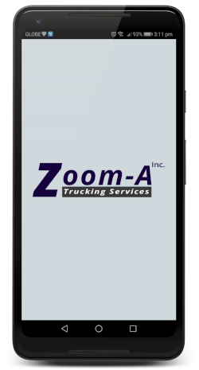

ZoomApp is a mobile application that I created for a client that wanted a mobile solution for an inventory and tracking system.

The application is specifically tailored for the client's use case. Equipped with a barcode and camera functionality, it helps the clients track the products that are being delivered across the country.

> "He's very professional and knowledgeable in this line of work. He's one of the best collaborators in this industry. He will surely give you the finished product/project beyond expectation. We will surely come back and get his service again in the future." — Karen Daguio, Sendeya
