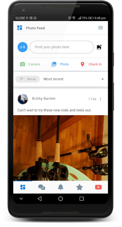

It's a social media platform for line fishing enthusiasts. Users can share their latest catch, fishing spots, tips and tricks. There's also a Question and Answer section that works much like Quora.

An admin CMS was also built to manage and moderate user activity. Client also regularly publish promos and giveaways directly to the app notifying all connected users via push notifications.

I designed everything from the UI/UX to the backend API architecture. This is one of those projects wherein I had a lot of fun building.
