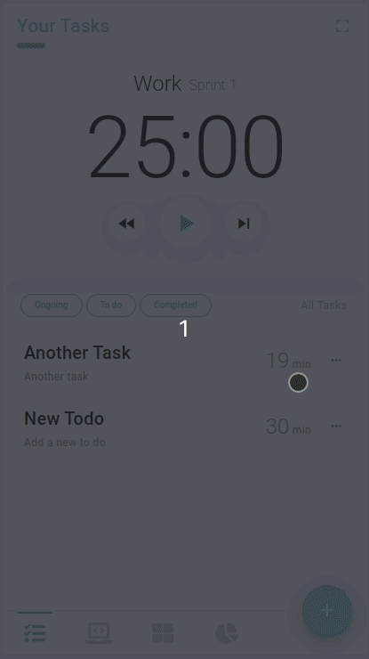
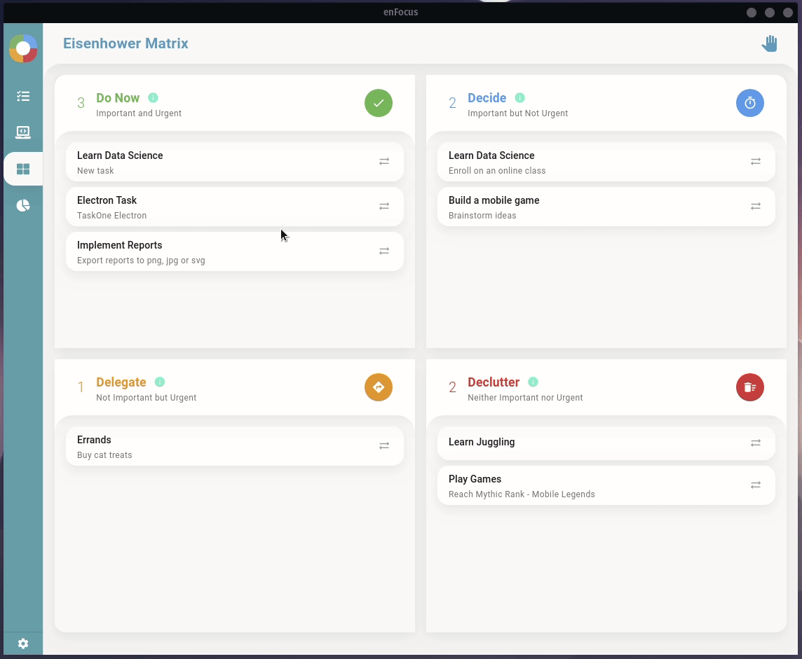

[**enFocus**](https://getenfocus.com) combines of three of the best productivity techniques: To-do list, Pomodoro and Eisenhower Method in one cohesive workflow, presented in a simple, clean and minimalist app. It's available in [Desktop](https://getenfocus.com/download) (Windows, Linux) and [Mobile (Android)](https://play.google.com/store/apps/details?id=com.nightowl.enfocus.app) platforms.

- 📋 Organize your tasks into projects.
- ⏱️ Work on your tasks into chunks of focused sprints.
- ⚖️ Manage priorities, eliminate "mere-urgency" and time-wasters tasks.
- 📊 Keep track of your progress.

**The Pomodoro Technique®** is a time management method developed by Francesco Cirilo in the late 1980's. The technique uses a timer to break down work into intervals, 25 minutes in length, separated by short breaks of 5 minutes, and a 15-minute long break after 4 successive sprints. This philosophy aims to provide the user with the maximum focus and creative freshness, thereby allowing them to complete projects faster with less mental fatigue.

**The Eisenhower Method** complements the Pomodoro Technique really well. This method stems from a quote attributed to Dwight D. Eisenhower: *"I have two kinds of problems, the urgent and the important. The urgent are not important, and the important are never urgent."*

The Eisenhower Method is a simple tool for considering the long-term outcomes of your daily tasks and focusing on what will make you most efficient, not just most productive. Visualize all your tasks in a matrix of urgent/important. All of your daily tasks and projects should fall into one of these four quadrants:

- Urgent & Important tasks are to be done immediately
- Not Urgent & Important tasks are to be scheduled or considered in other quadrants
- Urgent & Unimportant tasks are to be delegated to someone else
- Not Urgent & Unimportant tasks are to be deleted

**Other Features**

- Lightweight
- Keeps screen on
- Swipe tasks to complete or start
- Sprint Duration options
- Group tasks into projects
- Fullscreen mode
- No personal data collection
- and more

**Premium Features**

- More Sprint Duration options
- Custom reports
- Export reports to CSV, PNG or SVG
- Ad free
- All future features are free
- **Feature priority suggestions*

**enFocus is designed to strongly adhere with the Pomodoro Technique and The Eisenhower Method to keeps things authentic and also simple.*
